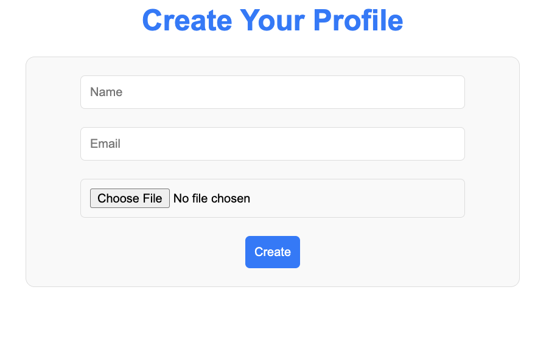
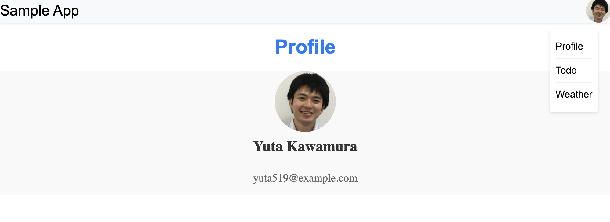
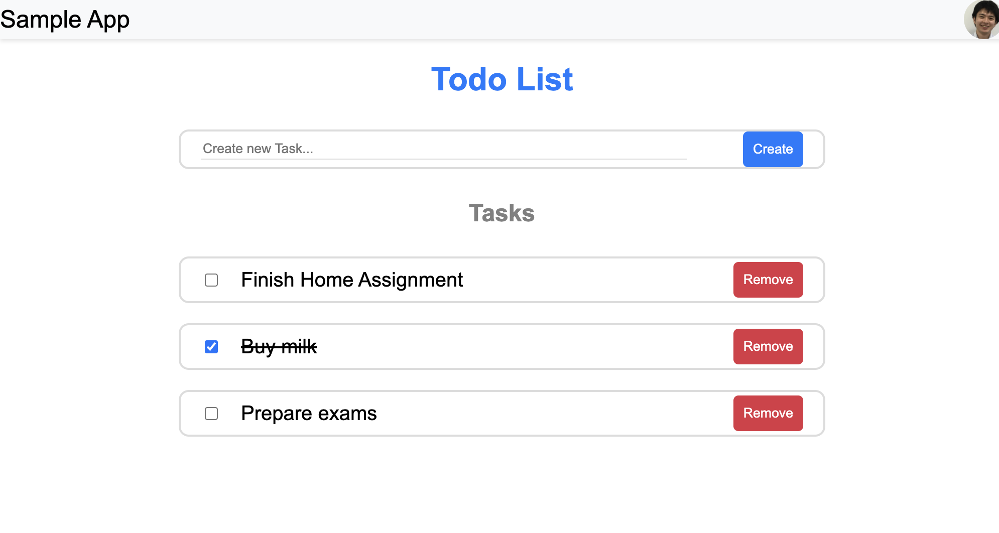

# Personal Dashboard App

This is a web application project with React. There 3 main pages, profile, todo list and weather. You can access the [demo](https://personal-dashboard-app-plum.vercel.app).

## Installation

Instructions on how to install this project.

```bash
# Clone the project
git clone https://github.com/yuta519/personal_dashboard_app.git
cd personal_dashboard_app

# Installation
npm i
```

## Starting

Start the project with the command and visit [http://localhost:3000](http://localhost:3000).

```bash
# Start
npm start
```

## Test

```bash
npm test
```

## Design Decision

### SOLID principles

- This project is being developed by caring SOLID principles.
- In detail:
  - Each files have a single responsibility.
    - The files in `pages` directory care how to present UI, whereas the ones in `components` directory care how to present UI.
    - To manage data and business logics, `hooks` is prepared.
  - Dependency is isolated from components by `hooks`.
    - If `page` compoent includes the codes related with exteral APIs, it would be difficult to extend in the future.
    - `page` components use `hooks` and external dependencies are managed there.
    - When you switch dependened libraries are changed, your components don't need to care it.

#### Disclaimer

- The React library in particular has its roots more in the functional programming paradigm. So SOLID principles which originates from OOP is difficult to apply perfectly.
- In this project, the author have tried his best way from what each principle is attempting to do.

## Tech stacks

<p>
  <a href="https://styled-components.com/" target="_blank" rel="noreferrer">
    
  </a>
  <a href="https://reactjs.org/" target="_blank" rel="noreferrer">
    
  </a>
  <a href="https://redux.js.org" target="_blank" rel="noreferrer">
    
  </a>
  <a href="https://reactrouter.com/en/main" target="_blank" rel="noreferrer">
    
  </a>
</p>

## How to explore app

- Signup

  - The app will show the signup page at the first time you visit.
  - Please input your information. Name and Email are required.
  - 

- Profile

  - Based on the information which you input, the app displays profile.
  - By clicking the avatar icon on the right side, dropdown menu appears and you can move another page.
  - 

- Todo List

  - You can create, remove, update your todos on this page.
  - 

- Weather
  - You can check weather information on this page.
  - Firstly, you need to search and specify a city.
  - By clicking a city name, the app tell you a weather of a city.
  - City and weather information is based on [OpenWeather API](https://openweathermap.org/api)
  - 
